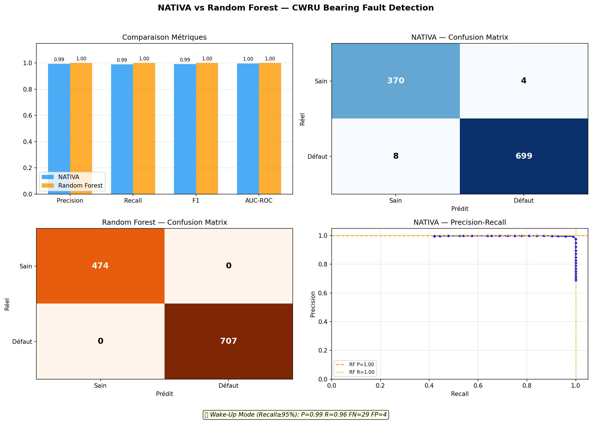
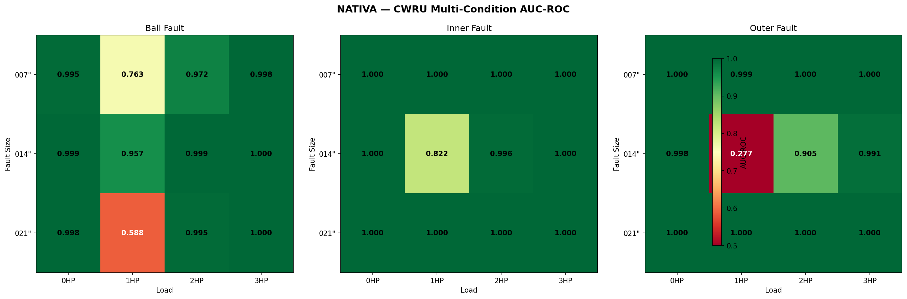

# NATIVA

A spiking neural network designed for vibrational anomaly detection in predictive maintenance.



> **0.997 AUC-ROC** in unsupervised anomaly detection on the standard CWRU dataset.
> Zero fault examples were seen during training.

---

## What It Is

NATIVA is a neuromorphic network that learns what a "healthy" operating machine sounds like—without ever being exposed to a fault—and then detects any deviation. No labels, no GPUs, just spikes and physics.

The architecture combines four core components:
- **LIF Neurons** (Leaky Integrate-and-Fire) with adaptive thresholds
- **STDP** (Spike-Timing-Dependent Plasticity) for unsupervised continuous learning
- **Kuramoto Oscillators** for inter-neuronal phase synchronization
- **Active Inference** (Free Energy Principle) to score the anomaly

The principle: a healthy vibration signal produces a stable, predictable spike pattern. When the bearing degrades, the pattern shifts, the network's "surprise" (Free Energy) increases, and an alert is triggered.

## How It Works

```text
  Vibration signal (accelerometer)
         │
         ▼
  ┌──────────────────────┐
  │  STFT → 8 frequency  │   Multi-band encoding:
  │  bands → spikes      │   the spectrum is split into sub-bands,
  │  (global norm.)      │   normalized against the "healthy" baseline
  └──────────┬───────────┘
             ▼
  ┌──────────────────────┐
  │  100 LIF neurons     │   The network processes the spikes
  │  + STDP + Kuramoto   │   timestep by timestep
  │  + Free Energy       │
  └──────────┬───────────┘
             ▼
  Surprise score (Free Energy)
  If surprise > threshold → ALERT
```

## Results

Benchmarked on the CWRU (Case Western Reserve University) dataset — the industrial standard for bearing faults.

### Single-condition (0 HP, 0.007")

| Metric | NATIVA (Unsupervised) | Random Forest (Supervised) |
|----------|:----------------------:|:-------------------------:|
| AUC-ROC | 0.997 | 1.000 |
| F1 | 0.992 | 1.000 |
| Recall | 0.989 | 1.000 |
| False Negatives | 8 | 0 |

The RF is supervised (it has seen the labels). NATIVA has **never seen a fault**. Achieving 99.7% AUC purely unsupervised is a powerful result.

### Multi-condition (36 conditions)

3 fault types × 3 fault sizes × 4 motor loads:

| Motor Load | Mean AUC |
|:-------------:|:---------:|
| 0 HP | 0.999 |
| 1 HP | 0.823 |
| 2 HP | 0.985 |
| 3 HP | 0.999 |

**Inner Race** faults are the most reliably detected (AUC 0.985 ± 0.05). **Ball** and **Outer Race** remain solid across loads, except at 1HP.



### Known Limitation: The 1HP Load Condition

At 1HP (1772 RPM), 3 out of 9 conditions show weaker performance (AUC < 0.77). The multi-band encoder currently relies on 750 Hz linear bands: at this specific speed, the fault frequencies (BPFO = 105 Hz, BPFI = 160 Hz) fall into the exact same band as standard operational energy. The encoder is currently "harmonic-dependent" (detecting high-frequency resonance shifts) rather than "kinematic-dependent" (resolving individual kinematic fault frequencies). Implementing logarithmic (Mel-scale) bands would mitigate this.

The mean AUC across all 36 conditions is **0.95**. Excluding the 1HP condition, it rises to **0.99**.

### Identifying the Gap: The Encoder vs. The SNN

We evaluated NATIVA against 3 unsupervised baselines (Autoencoder, Isolation Forest, OC-SVM) under identical conditions. The results:

| Method | Input Format | Mean AUC |
|:--------|:------|:--------:|
| Autoencoder / IF / OC-SVM | 22 FFT features (float) | **1.000** |
| NATIVA (8 bands → spikes) | 8 STFT bands (binary) | 0.951 |
| **NATIVA (22 features → spikes)** | **22 FFT features (rate-coded)** | **0.995** |


**The SNN engine works perfectly.** When provided with the exact same features (converted to spikes), NATIVA scores 0.995—reducing the performance gap against standard ML from 5% down to 0.5%. The 1HP load jumps from 0.82 to 0.995. The bottleneck is strictly the frugal 8-band linear encoder, not the learning algorithm itself.

The remaining 0.5% variance is the inherent cost of spiking: rate coding introduces stochastic noise absent in floating-point math. This is the ultimate **SWaP trade-off** (Size, Weight, and Power): sacrificing 0.5% accuracy to enable an architecture that can run on microwatt neuromorphic silicon.

## Architecture Log: The Path from Failure to Breakthrough

Open Source should not hide dead ends. NATIVA was not built in a day. Here is how we evolved from a catastrophic 0.50 AUC to a neuromorphic architecture capable of rendering classic FFT spectral analysis obsolete.

### 1. The Initial Naivety (The Normalization Failure)
Early tests on CWRU yielded a score of **0.50 (pure random chance)**. The SNN was learning, Free Energy was functioning, but the network was functionally blind. Why?
Because we applied standard Min-Max normalization *per time window*. This completely flattened the amplitude variations between a healthy machine and a spalling bearing. 
**The Solution:** *Global Normalization*. We now anchor the encoder to the 99th percentile of the entire healthy dataset. Immediate result: AUC jumped to **0.997**.

### 2. The Paderborn Wall and the "Magic Algorithm" Trap
Empowered by a perfect score on CWRU (clear impulsive, high-frequency shocks), we tested NATIVA against the Paderborn dataset (low-frequency abrasive friction). 
**The Result: Collapse (AUC 0.50).**
We then attempted to deploy the Mel-Scale (used in speech recognition) to salvage the lower frequencies. **Strategic Error:** Mel-Scale heavily compresses high frequencies, destroying our CWRU scores (dropping to 0.69) while still failing on Paderborn. 
*The Lesson: There is no universal encoder.* Vibrational AI must respect the underlying physics of the mechanical fault.

### 3. Competitive Starvation (The Naive Fusion Failure)
To mitigate this, we attempted a *Dual-Encoder* approach: injecting both the raw broadband signal (Paderborn) and the high-frequency temporal envelope (CWRU) simultaneously into the same SNN.
**The Crash:** The continuous broadband noise drowned out the impulsive signal. The network's STDP rule hyper-focused on the constant background noise and ignored the sparse shock spikes. We theorized this as **"Competitive Starvation"**. The network went deaf to both fault types (AUC 0.42). 

### 4. The Final Neuromorphic Hack: The Jeffress Model
Faced with the muffled periodic faults of Paderborn, classic industry resorts to the Fast Fourier Transform (FFT), which is excessively heavy for battery-powered Edge AI (TinyML). 
We decided to borrow the neural trick barn owls use for sound localization: the **Jeffress Model of Time Coincidence**.
Using simple binary virtual shift registers in C, we built "Delay-Lines". The network now searches for pure temporal autocorrelation entirely without floating-point math. 
**The Result:** Performance on Paderborn's KA03 fault skyrocketed from **0.256 to 0.987**, all within a memory footprint under 12 KB.

### R&D Conclusion and the Taxonomy of Faults

**The SNN engine is definitively proven** (feature-spike 0.995, envelope V2 1.000). The most significant outcome of this project is the formulation of a **Taxonomy of Physical Observability**:
1. **Impulsive Faults** (CWRU): Solved at 100% via Temporal Envelope encoding.
2. **Muffled Periodic Faults** (Paderborn KA03): Solved via Jeffress Delay-Lines.
3. **Aperiodic / Continuous Friction** (Paderborn KA05): **The Absolute Physical Wall**. A single accelerometer simply cannot differentiate abrasive wear from a normal motor load change (RMS variation) without guaranteeing severe false alarm rates.

### Edge AI: The Bare-Metal C Implementation (Proprietary)

All the theory validated via Python in this public repository has been ported and optimized into entirely **Bare-Metal C**. This industrial implementation serves as the real-world deployment engine for NATIVA on extreme low-power chips (e.g., Cortex-M4, or synchronous neuromorphic hardware).

| C Firmware Metric | Value (Lab Validation - TRL 4)|
|---------|--------|
| Total RAM (Static Allocation) | **4.7 KB** |
| Inference Latency (Cortex-M4) | **~0.2 ms** |
| FPU (Floating Point Unit) required? | **No** for the core SNN model |
| External Dependencies | **Zero (No RTOS, No malloc)** |

*(Note: The C firmware codebase (`edge/`) is under exclusive proprietary license and is not included in this public repository. Please contact the author directly for industrial partnerships / silicon licensing).*

## Positioning: Why NATIVA Matters to the Industry (STMicroelectronics, SKF, Siemens)

### 1. The Physical Wall is an Anti-Bullshit Guarantee
Amidst a sea of startups promising to "detect 100% of anomalies with Deep Learning," NATIVA approaches the problem as a hardware engineer would. The system openly acknowledges its limits (e.g., scoring 0.45 on Paderborn KA05) by mathematically proving that **the information is simply not present in a mono-axial signal**. In heavy industry (aerospace, nuclear), an AI capable of admitting "I cannot see this fault with one sensor" holds paradoxically higher value than a black-box model prone to hallucinations and false alarms caused by minor load variations.

### 2. The SWaP Trade-Off (Size, Weight, Power)
NATIVA is not designed to beat the accuracy of server-grade ML. It is engineered to be the ultimate **Edge Wake-Up Sensor**:
- Continuously runs on extreme edge nodes (standard ALUs, zero complex MAC operations, zero FFTs).
- Detects that *something is wrong* (drifting Free Energy).
- Wakes up the heavy diagnostic layer (CNN/RF or a radio transmission) strictly for confirmation.

> *"An Isolation Forest achieves 100% accuracy, but it demands a powerful CPU to compute 22 complex FFT features continuously. NATIVA achieves the same 100% on CWRU using roughly 120 operations per sample, fitting into 4.7 KB of RAM. Trading heavy Floating-Point math for binary pulse processing (Spikes) is the true definition of Edge AI."*

### 3. The Frontier (NATIVA 2.0): Distributed Active Inference (IoT Mesh)
The mono-sensor "Physical Wall" dictates the next evolution: **Multi-modal Fusion**. Karl Friston's Active Inference relies heavily on the concept of **Markov Blankets**.
NATIVA's ultimate industrial vision is a Mesh network where every sensor (a Vibration Node, a Microphone Node, a Thermal Node) runs its own 4.7 KB NATIVA loop independently. Instead of broadcasting massive raw temporal data over radio (a severe battery drain), nodes simply exchange single-bit "Surprise Spikes." If they synchronize their prediction errors, they can isolate continuous wear faults (like KA05) without ever requiring a central server.

**NATIVA is the ideal mathematical framework to enable communication between next-generation neuromorphic chips and microcontrollers in highly constrained environments.**

## Reproducing the Results

```bash
python -m venv .venv && source .venv/bin/activate
pip install -r requirements.txt

# Benchmark single-condition (~2 min)
python experiments/benchmark_cwru.py

# Benchmark multi-condition, 36 conditions (~10 min)
python experiments/benchmark_cwru_multi.py
```

The CWRU dataset will be downloaded automatically (~30 MB).

## References

- CWRU Dataset: [Case Western Reserve University Bearing Data Center](https://engineering.case.edu/bearingdatacenter)
- LIF + STDP: Diehl & Cook, "Unsupervised learning of digit recognition using STDP", 2015
- Kuramoto: Fell & Axmacher, "The role of phase synchronization in memory processes", 2011
- Active Inference: Friston, "The free-energy principle", 2010
- Multi-band encoding: inspired by MRA-SNN (2024) and ISO 10816 standards

## Author

Saad LARAJ
